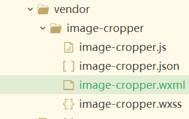
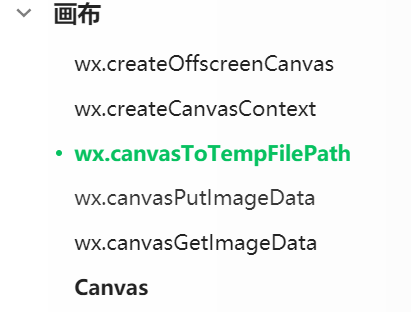
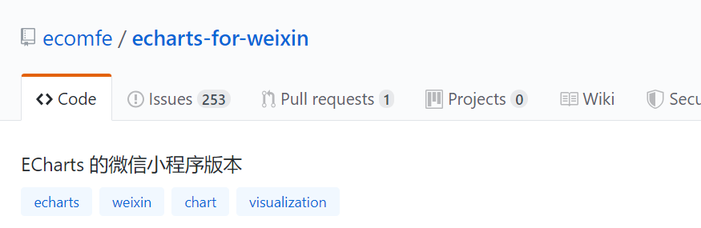
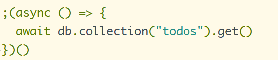
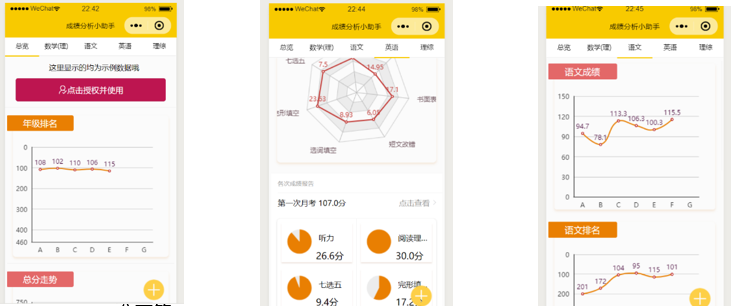
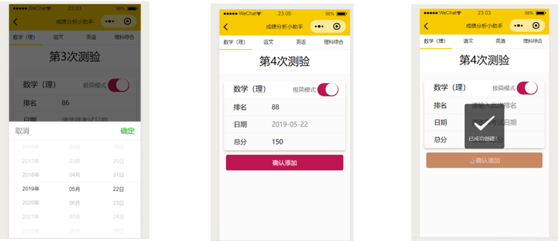
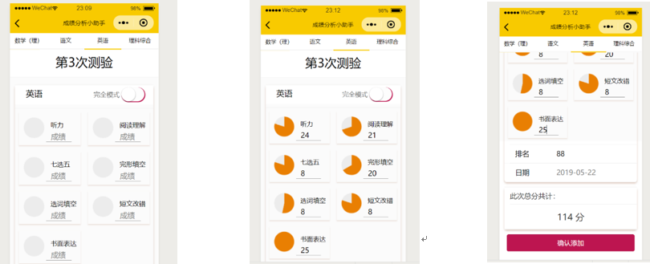

# grade

> 2019微信小程序开发大赛

基于学生端的，用于管理学生成绩的可视化微信小程序工具，目前已经上线。

## 使用
 - 微信开发者工具直接打开dist目录即可

 - mpvue再开发
  1. 进入到grade目录中
  2. `npm i` 安装依赖
  3. `npm run dev` 进入开发环境

## 主要技术

#### 整体架构
小程序端采用Vue语法编写，最后通过mpvue转化为微信小程序原生语法，并且经过webpack打包压缩等，最终仅有660kb的大小。
服务端采用微信生态的云开发，简化开发流程，上线版本使用生产云环境，加上云开发相关的优势等，为小程序提供强有力的支持。

#### UI部分
主要由自主开发，其中部分规范采用了WeUI的设计建议。

#### 数据图表展示
采用开源库Echarts,并且搭配专为微信小程序提供的版本。

#### 数据库与存储
采用小程序云开发中的云数据库与云存储实现。
  
## 关键技术点

#### 上传的图片如何按照自定义的尺寸？
 - 【思路及方案】

 考虑到上传图片大小的不同，并且我们所呈现的位置大小是固定的，所以必须要对图片进行裁剪，不然就会压缩图片，影响用户的体验。这里使用了Canvas的相关技术，并且参考了github上的相关代码，其核心是Canvas的填充图片的功能，并且最终将图片转换成了临时图片存储到云开发中。

  

- 【总结】

小程序端并没有提供很好比较好的图片裁剪API，但是图片裁剪这个场景又用的十分频繁。这里是采用一种变通的方法，将图片上传到Canvas之后，再生成临时图片链接，生成的图片是以云文件ID的形式上传上去，这一点和小程序耦合性很强。

#### 如何在小程序中数据可视化？小程序几乎不能操作DOM节点。
 - 【思路及方案】

 由于EChart是要操作相关的dom节点，并且利用Canvas进行画图，但是微信小程序不能对domdom节点进行操作，这里主要是用了ECharts的官方微信小程序插件。并且结合到了mpvue中进行使用，基本配合其官网参考手册配置就没什么问题，还有重要的一点就是体积大小的限制，进行按需引入，并且最后要进行代码的压缩，不然可能会超出目前小程序主包2M的限制。

  

- 【总结】

在使用一些官方提供的小程序插件的时候，一定要仔细看官方文档写的，尤其是一些配置，可能会与他的主版本不一样，例如一些toolbar目前虽然已经支持，但却不是很好，还有就是异步刷新图表的问题，一定要注意看官方文档中的解释。

#### 怎样使用云函数的触发更快？在保证并发的前提如何保证顺序？
 - 【思路及方案】

 请求次数多的时候，很有可能会造成等待时间过长，所以必须要进行Promise的相关应用，当所有的请求并发了，等待的时间才会有所下降，并且一定要注意顺序的问题，可以使用ES6的相关高级语法解决，如 Promise.all([…])

- 【总结】

在使用Promisee的时候，如果采用链式调用，一定要注意then的区别，千万注意不要让链断了，在云函数使用更是如此，并且如果使用es6的新用法，如果没有办法在函数声明的时候申明async，那么可以在立即函数调用它,如下代码

 

## 部分项目截图

- 欢迎页

 

- 体验页

 

- 成绩录入页

  

  

